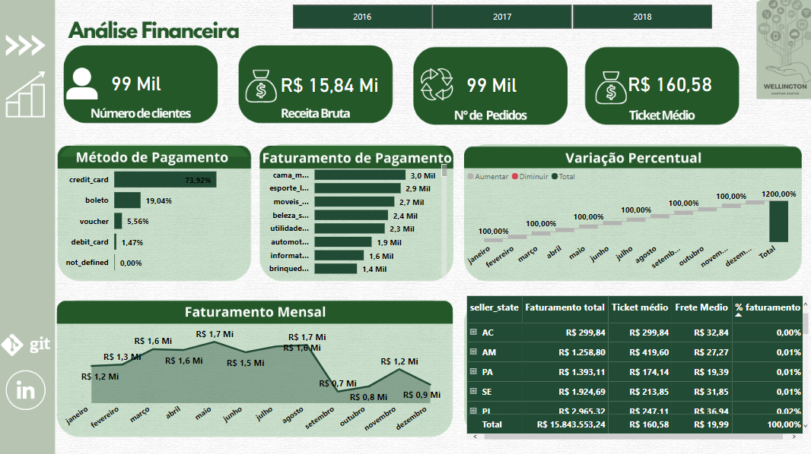

#** Dashboard Análise do E-Commerce**

# Introdução do problema

Elaborei algumas análises no conjunto de dados públicos de comércio eletrônico brasileiro por Olist Store, foi primeiramente entendido o problema, em seguida coletado e tratado os dados, logo após relacionado e criado as medidas, e por fim foram feitas as visualizações de dados. Os indicadores do E-Commerce analisados foram: total de pedidos, ticket médio, número de clientes, método de pagamento, faturamento, tempo médio de entrega e situação dos pedidos.  

Problema: Localizar regiões de maiores impactos no faturamento e promover visibilidade da situação dos pedidos.

Dataset: Dados foram extraídos do Kaggle (https://www.kaggle.com/datasets/olistbr/brazilian-ecommerce)

Conclusão: Uma vez que 70% dos clientes são de São Paulo, o Estado tem o maior faturamento e o menor gasto com frete em média. Quanto aos meses de maiores receita é maio e agosto.

O tempo médio de entrega é de 12 dias, sendo que 92,85% das entregas são entregues no prazo. Referente ao ano de maior quantidade de pedidos no prazo foi de 2016.

[Dashboard](https://app.powerbi.com/view?r=eyJrIjoiZTBiYTE2M2EtZGI5Yy00NmUwLThiOGYtYWNkZWVmYjhiMmI4IiwidCI6ImVmMDhmOTQ4LTMzNzItNDA2OC1hZTVkLTg3M2FhODViZTk5NCJ9)

[Linkedin](https://www.linkedin.com/in/wellington-martins-5a19638b/)

